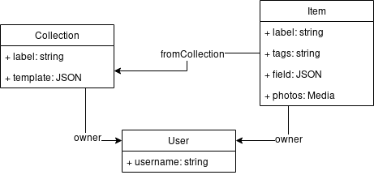

<!-- $size: 16:9 -->
<style>
/* Workaround transparent png */
img {
  background-color: transparent!important;
}

.slide .title-slide h1 {
  color: white !important;
  text-shadow: 5px 5px 15px black !important;
}

/*
.footer {
	width: 50px;
    height: 50px;
    background: url(img/logo-sfeir.png) no-repeat;
    background-size: cover;  
   	position: absolute;
    bottom: 0;
    right: 0;
}*/

.circular-me {
	width: 300px;
	height: 300px;
	border-radius: 150px;
	background: url(img/me.jpg) no-repeat;
    background-size: cover;
}

.col2 {
	width: 50%;
}
.col-left {
	float: left;
}
.col-right {
	float: right;
}

</style>


<div class="title-slide">


<br/><br/><br/><br/><br/><br/><br/><br/><br/><br/><br/><br/>

<h1>Faire un back en 10 min, c'est possible ?</h1>
</div>


--- 
<!-- footer: CC-BY-ND 2019, Anthony Pena. -->

# Les Projets web aujourd'hui

---
# Les Projets web aujourd'hui


---

# Les Projets web aujourd'hui

- L’API ne fait qu'exposer la bdd avec une couche d’authentification et d'autorisation. 
- Elle ajoute souvent peu de règles métier. 
- On passe notre temps à réécrire des GET, POST, PUT, DELETE...

<br/><br/>

**On perd du temps sur des aspects techniques plutôt que créer de la valeur métier !**

--- 
# Des solutions existent

- Spring Data Rest 
- PostgREST
- Strapi
- Cockpit
- Wordpress Headless
…

--- 
# Parlons peu, parlons Strapi

--- 
# Parlons peu, parlons Strapi

> The open source Headless CMS Front-End Developers love.

- Une interface d'administration simple à utiliser 
- Rien de magique, on a accès au codé généré
- API REST et GraphQL 
- Authentification & Authorization via JWT 
- Gestion des médias (images, vidéo, etc.) 
- Choix de la bdd (mysql, postgres, sqlite, mongodb)
- Plugins


--- 
# Comment ça marche ? 

--- 
# Comment ça marche ? 

Etape 1 : 
- Installer le CLI
- Démarrer une BDD
- Créer un projet 

--- 
# Comment ça marche ? 

Etape 2 : Créer le modèle de donnée
- Créer les objets
- Définir leurs champs
- Sauvegarder 

--- 
# Comment ça marche ? 

Etape 3 :
- Créer le frontend

--- 
# Et si je veux filtrer mes données ?

--- 
# Et si je veux filtrer mes données ?

Les Filtres :
- Built-in
- on passe par des opérateurs en query parameter :
	- `GET /products?price_gte=3`
	- `GET /products?id_in=3&id_in=6&id_in=8`
	- `GET /posts?author.company.name=strapi`

--- 
# Et si je veux filtrer mes données ?

On a aussi des opérateurs de tri et de pagination :
- `GET /users?_sort=email:asc,createdAt:desc`
- `GET /users?_start=10&_limit=10`

--- 
# Et mes règles métiers ?


--- 
# Et mes règles métiers ?

Les Policies :
- fonctions appelées à chaque appel sur une route
- on peut agir avant l'accès à la base ou après
- on choisi les routes

---
# Et mes règles métiers ?

```
module.exports = async (ctx, next) => {
  await next();

  if (ctx.status === 404) {
    ctx.body = 'We cannot find the ressource.';
  }
};

```
---
# Let's make a backend!


---
# Let's make a backend!




---
# Et du coup Strapi c'est la vie ?

---
# Et du coup Strapi c'est la vie ?

&minus; On a pas forcément assez de doc
&minus; Très orienté "public first"

&plus; C'est très simple et rapide de se lancer
&plus; On peut faire beaucoup de chose très vite

--- 

<div class="col2 col-left">
<div class="circular-me"></div>

# Anthony Pena
## *@_Anthony_Pena*
## pena.a@sfeir.com
</div>
<br />
<div class="col2 col-right">
<br /><br /><br /><br />
  
# Des question ?

</div>

<!--
Resources:
- https://alpha.wallhaven.cc/wallpaper/660873

-->