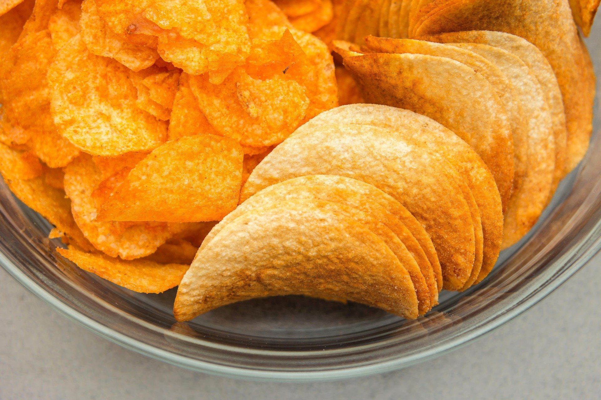

<!-- _class: main-heading-top h1-white -->

# JDR & MJ
###### Anthony Pena

<!--  dices: 3 -->

---
<!-- _class: main-heading-top right -->

# Jeux de Rôle ?

---
<!-- _class: main-heading-top -->

# Jeux de Rôle ?

> [...] un jeu de société dans lequel les participants conçoivent ensemble une fiction par l’interprétation de rôles et par la narration, dans le cadre de contraintes de jeu qu’ils s’imposent

> -- Wikipédia

<!--  dices: 2 -->

---
<!-- _class: main-heading -->

# Comment ça se joue ?

<!--  dices: 1 -->

---
<!-- _class: main-heading-top -->

# On mange,  On boit,  On joue

---
<!-- _class: main-heading h1-white -->

# Et on lance les dés !

<!--  dices: 5 -->

---
<!-- _class: main-heading-top h1-border-white -->

# Est-ce que ces dés existes ?

<!--  dices: 5 -->

---

# 2 faces ?

---

# 2 faces ?

<!--  dices: 0 -->

---

# 3 faces ?

---

# 3 faces ?

<!--  dices: 4 -->

---

# 4 faces ?

---

# 4 faces ?

<!--  dices: 1 -->

---

# 100 faces ?
---

# 100 faces ?

<!--  dices: 5 -->

---

> Bon ! Moi je veux être un elfe de la nuit punk !
> -- Mr.T

---

            

> Et pourquoi pas un nain de jardin en platre ?

---
<!-- _class: main-heading-top h1-white right -->

# Meneur du Jeu ?

<!--  dices: 5 -->

---
<!-- _class: main-heading-top h1-white -->

# Meneur du Jeu ?

>Le meneur de jeu est généralement l'organisateur de la partie [...]. Il a un triple rôle de conteur, d'arbitre et d'encadrant pour les participants joueurs et leurs personnages
> -- Wikipédia

---

# Joueurs = Victimes
# ?
# MJ = God

---

---
<!-- _class: main-heading-top -->

---
<!-- _class: main-heading-bottom h1-white -->

# MJ = lire beaucoup ?

<!--  dices: 1 -->

---

<!-- _class: main-heading-bottom h1-white -->

# Se lancer comme joueur ?

---

<!-- _class: main-heading-bottom h1-white -->

# Se lancer comme MJ ?

---

<!-- _class: main-heading-top h2-white -->

## Combien de dé sont apparus durant la présentation ?

<!--  dices: 5 -->

---

# 37