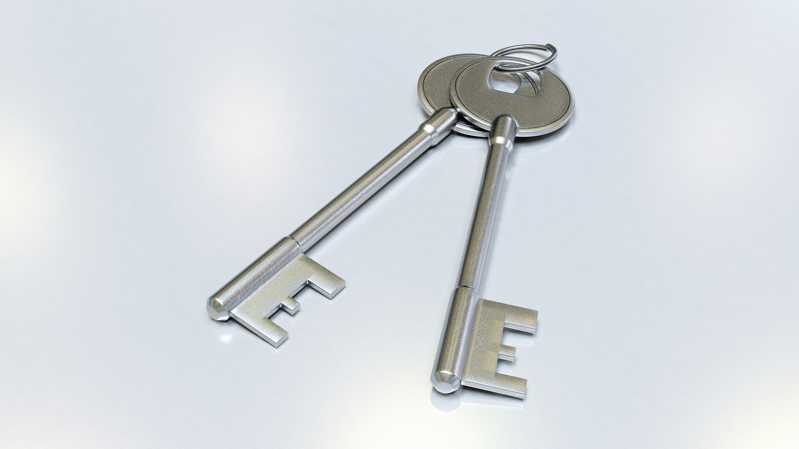
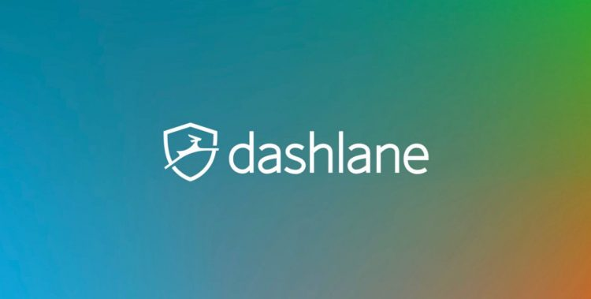
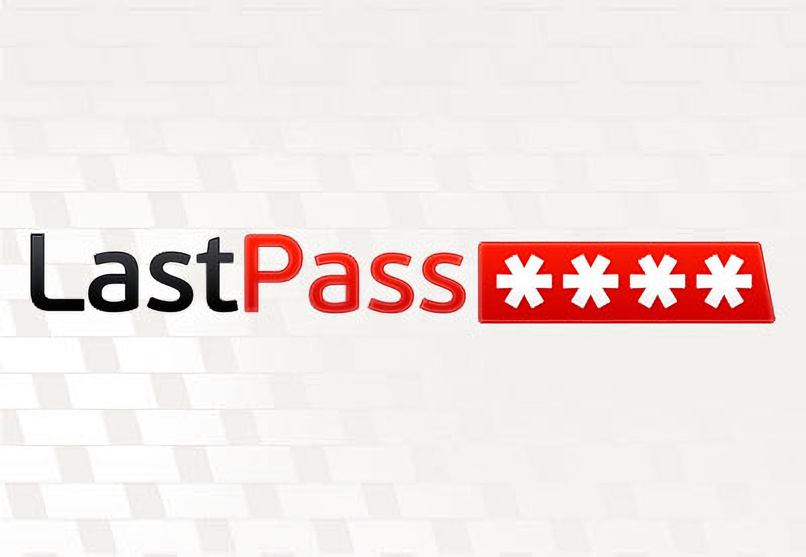
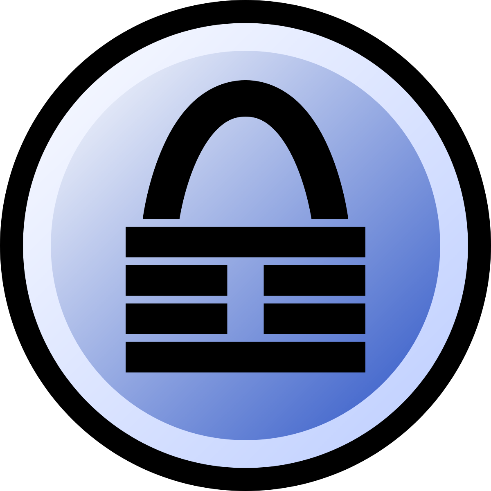
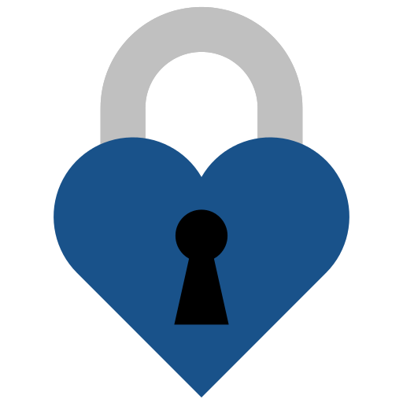
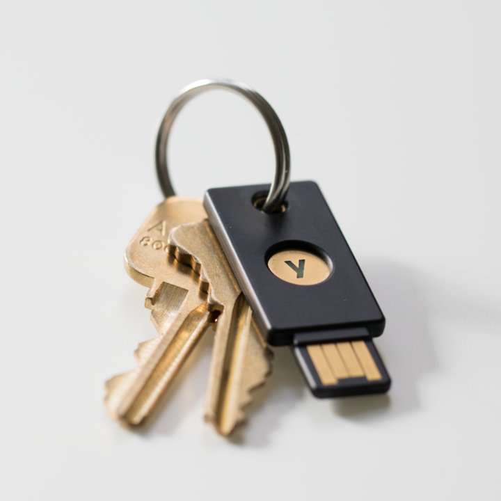

<!-- _class: main-heading-top h1-white -->

# Une histoire de mot de passe
###### Anthony Pena

---

# De quoi on parle quand on dit "mot de passe" ?

<!-- Une séquence de caractère qui sert de clé pour accéder à des données sécurisés -->

---

# C'est quoi un bon mot de passe ?

<!-- Un mot de passe qui sera assez long et/ou compliqué pour être difficile à deviner (pour un ordinateur) -->

---

# Un mot de passe long ?

> JeSuisUnMotDeP@sseSuperLongMaisFaçileÀRetenir,Non?
> 50 caractères

> Monsieur, j’ai deux mots à te dire...
> -- *Comédie en trois baisers*, Arthur Rimbaud
> 37 caractères

---

# Un mot de passe compliqué ?

> \-$=*.ABj_
> 10 caractères aléatoires

---

# Long ?

# Compliqué ?

---

# Les deux ?

> vtJfx-PEHucJNvV&DGN@yFU_9jZFPJZwe4Nmnbe=@nV4UMGx&h=NLr=5R?4a57fPDg5xkz#MsG%sx-Bn!H?&jqQyfS*t@t_R?fM?gdy$322K%L+N^QvjS8q&
> 120 caractères aléatoires

---

# Impossible de le retenir par cœur...

---

# Comment gérer ses mots de passe ?

---

# Niveau 0 : 1 seul mot de passe

<!--
- pas ouf car en cas de fuite on est cramé
- si on doit le changer c'est compliqué (souvent une des raisons qui fait qu'on en a pas un seul)
-->

---

# Niveau 1 : post it everywhere

<!--
- pas ouf car on peut très facilement les perdre ou se les faire voler
- en général ça reste en vue donc c'est facile de deviner que c'est un mot de passe
-->

---

# niveau 2 : un fichier sur l'ordinateur ou un cahier/carnet/papier

<!--
- bof bof
- rarement à jour
- problématique de synchro
- et si quelqu'un a accès à notre ordi il se passe quoi ?
-->

---

# niveau 3 : mots de passe dans le navigateur

<!--
- pas ouf parce que du coup on ne maitrise pas du tout ce qui est fait de nos mots de passe
- beaucoup de gens cherchent des failles dans les navigateurs et ça arrive souvent qu'il y en ait côté mot de passe
- souvent très peu sécurisé car très peu voir pas du tout chiffré, donc n'importe qui pourrait lire les mots de passe sur le réseau
-->

---

# niveau 4 : gestionnaire de mot de passe propriétaire (1password, lastpass, dashlane, etc.)

<!--
- beaucoup mieux dans le sens où on a quelque chose censé être sécurisé pour le stockage des mdp
- on ne sait pas si c'est fiable en vrai
- on ne sait pas si le chiffrement est bout en bout (contenu pas accessible à l'entreprise)
- quid de la fermeture de l'entreprise ?
- solution clé en main
- user friendly
-->

---

# niveau 5 : gestionnaire de mot de passe open-source (Keepass(2/XC), pass, Bitwarden, etc.)

<!--
- beaucoup mieux car on utilise un logiciel qui peut être étudié
- pas de backdoor
- souvent basé sur des standards de chiffrement reconnus
- peu de risque de pérénité
- attention aux problématiques de synchronisation
-->

---

# niveau 6 : double authentification via code

<!--
- on a besoin de deux choses pour s'authentifier : quelque chose qu'on connait et quelque chose qu'on possède
- difficile de voler les 2 en même temps
- souvent ça passe par un sms => bof, très facile d'intercepter des sms (zéro sécurité)
- les authentificateurs (type Google Authenticator) dépendent de service en ligne tiers
- l'objet est notre smartphone mais quid de l'authentification depuis le smartphone, ce que l'ont possède c'est l'objet lui-même ?
-->

---

# niveau 7 : double authentification physique

<!--
- le must aujourd'hui
- Yubikey en exemple
- offre un côté pratique pour gérer tout
- pas toujours disponible sur les services qu'on utilisent...
-->

---

# Où j'en suis moi ?

<!-- 
- niveau 5 avec pass (gitea perso auto-hébergé + ssh) 
    + encore quelques mots de passe que j'ai en tête (parfois réutilisé)
- un peu plus de 300 mots de passe dont une grande partie font 120 caractères aléatoires
- 
-->

---

[Aller sur le site](https://haveibeenpwned.com/)

