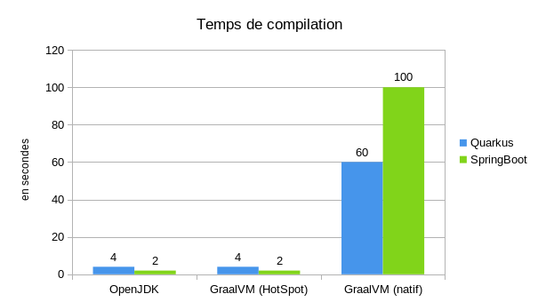
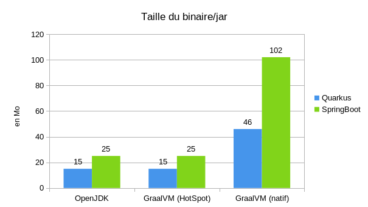
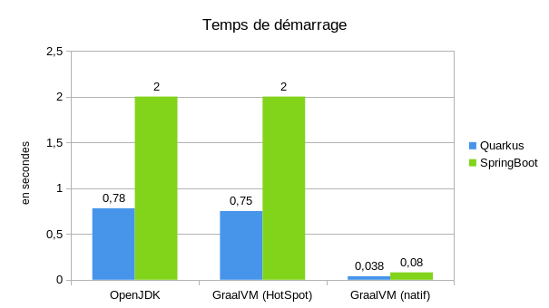
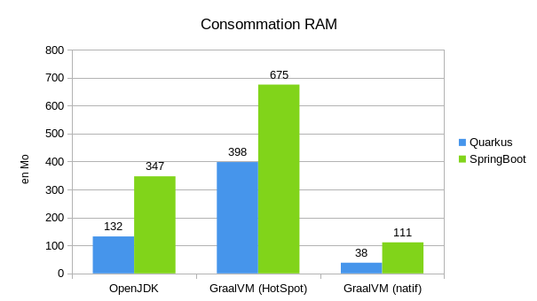

<style>
/* Global style */

section.main-heading h1 {
    font-size: 400%;
    position: absolute;
    bottom: 0.5em;
    right: 1em;
}
section.main-heading-top h1 {
    font-size: 400%;
    position: absolute;
    top: 0.5em;
    left: 1em;
}
section.main-heading-bottom h1 {
    font-size: 400%;
    position: absolute;
    bottom: 0.5em;
    left: 1em;
}
section.main-heading-top h2 {
    position: absolute;
    top: 0em;
    left: 1em;
}
section.main-heading-top h2 {
    position: absolute;
    bottom: 0.5em;
    left: 1em;
}
section.main-heading-top.right h1 {
    right: 1em;
    text-align: right;
}
section.main-heading-bottom.right h1 {
    right: 1em;
    text-align: right;
}
section.main-heading-bottom.right h2 {
    right: 1em;
    text-align: right;
}
section.h1-white h1 {
    color: white;
}
section.h1-border-white h1 {
    text-shadow: -3px 0 white, 
    0 3px white, 3px 0 white, 0 -3px white;
}
section.h2-white h2 {
    color: white;
}

section.multi-h1 h1:not(:last-of-type) {
    margin-bottom: 0;
}
section.multi-h1 h1:not(:first-of-type) {
    margin-top: 0;
}
</style>

<!-- _class: main-heading-top h1-white -->

<style scoped>
    h1, h6 {
        color: rgba(255,255,255,0.9);
        text-shadow: 0 0 15px rgba(255,0,0,.5), 0 0 10px rgba(255,0,0,.5);
        /* https://html-css-js.com/css/generator/text-shadow/ */
    }
    h6 {
        position: absolute;
        bottom: 0;
        right: 1rem;
    }
</style>

# Java à la vitesse de la lumière grâce au Graal !
###### Anthony Pena


<!-- https://pixabay.com/photos/highway-traffic-long-exposure-393492/ -->

---


# Reprenons les bases

---


# langages interprétés VS langages compilés

<!-- 
Interprétés : PHP, JavaScript, Lua, Python
 - on ne va pas créer une binaire
 - le code est lu par un programme qui va interprêter le code directement
 - généralement portable entre différente plateforme


Compilés : C/C++, Ada
 - le binaire n'est pas portable mais dédié à une plateforme
 - le binaire est composé d'instruction machine
 - c'est plus rapide
-->

<!-- https://unsplash.com/photos/5N75xeV9x9Q -->

--- 

<!-- _class: multi-h1 -->
<style scoped>
    h1:first-of-type {
        padding-top: 12rem;
    }
    h1 {
        text-align: center;
    }
</style>


# Java est un langage 
# un peu à cheval entre les deux
<!--
- on compile mais vers un bytecode
- ce bytecode sera compilé une seconde fois via un JIT à l'exécution
- le bytecode n'est pas du java, c'est des instructions proche d'un assembleur
- le jar est juste une archive zip avec des conventions
-->

<!-- https://unsplash.com/photos/LmQRYcJmtv8 -->

---

<!-- _class: multi-h1 -->


# Et la JVM dans tout ça ?

<!--
c'est la plateforme qui va faire de la magie avec le bytecode
    - interprétation du bytecode
    - compilation JIT (Just In Time)
    - intéraction avec l'OS
    - garbage collector
    - gestion des threads
    - ...
Tout ce qui fait qu'en Java on s'abstrait de la machine
-->

<!-- https://unsplash.com/photos/7C8c-7fwk34 -->

---


<style scoped>
    h1 {
        padding-top: 12rem;
        text-align: center;
    }
</style>


# Qu'est-ce que le Graal(VM) !

<!--
- on va maintenant rentrer au cœur du sujet : GraalVM
- C'est un set d'outils qui va se greffer autour d'une copie de l'OpenJDK
- ce n'est pas juste une réécriture, mais il y a 2 grandes nouveautés : la compilation native et la JVM polyglotte
-->

---
<style scoped>
h1 {
    color: rgba(255,255,255,0.9);
    text-shadow: 0 0 15px rgba(0,0,255,.5), 0 0 10px rgba(0,0,255,.5);
    /* https://html-css-js.com/css/generator/text-shadow/ */
    padding-bottom: 15rem;
    font-size: 200%;
}
</style>

# Polyglotte ?


<!--
- on peut faire exécuter plusieurs langages sur la JVM : JavaScript (dont Node.js), Ruby, Python, R et LLVM
- WebAssembly en experimental
- ces langages seront exécutés dans le même AST, dans la JVM, donc sans latence
- il y a juste des bridges pour demander l'exécution d'un autre langage (par exemple js dans Java)
-->


<!--
refs:
- https://www.graalvm.org/
- https://www.graalvm.org/reference-manual/wasm/

-->

---

```Java
import org.graalvm.polyglot.*;

class Polyglot {
    public static void main(String[] args) {
        Context polyglot = Context.create();
        Value array = polyglot.eval("js", "[1,2,42,4]");
        int result = array.getArrayElement(2).asInt();
        System.out.println(result);
    }
}
```

<!-- tiré de la documentation : https://www.graalvm.org/reference-manual/polyglot-programming/#start-language-java -->

---

On peut aussi écrire :

```Java
import org.graalvm.polyglot.*;

public class App {
    public static void main(String[] args) {
        try (Context context = Context.create()) {
            var x = 1;
            context.eval("js", "const y=2");
            Value fn = context.eval("js", "function foo(x) { return x+y; } foo"});
            System.out.println(fn.execute(x)); // will print 3
        }
    }
}
```

---

**Mais** on ne peut pas écrire :

```diff
import org.graalvm.polyglot.*;
public class App {
    public static void main(String[] args) {
        try (Context context = Context.create()) {
            var x = 1;
            context.eval("js", "const y=2");
+            context.eval("ruby", "z = 3");
-            Value fn = context.eval("js", "function foo(x) { return x+y; } foo"});
+            Value fn = context.eval("js", "function foo(x) { return x+y+z; } foo"});
            System.out.println(fn.execute(x)); // will print 6
        }
    }
}
```

---


# Compilation native pourquoi faire ?
<!--
- sur une JVM classique on a un temps de warm up assez long
- pas forcément un problème dans beaucoup de cas d'usage
- peu poser problème pour des cas comme le cloud où on démarre/coupe des services souvent
- un JRE est assez lourd et on utilise jamais tout
- le JIT prend du temps à tout compiler et donc au démarrage l'exécution est lente
-->

<!-- https://unsplash.com/photos/cYRMl1HeuVo -->

---


# Le Graal nous sauvera !

<!--
- compilation en binaire dès la première compilation
- plus de jar, plus de jvm à installer, mais directement un executable all-in-one incluant une jvm
- plus de JIT (comme tout est déjà compilé)
-->

<!-- https://unsplash.com/photos/2MSMhiycQuY -->*

---


<style scoped>
    h1 {
        padding-bottom: 12rem;
        text-align: center;
    }
</style>


# Oui mais...

<!--
- executable all-in-one veut aussi dire plus de chargement dynamique de jar
- pour être très optimisé une partie des API reflexions ne fonctionnent pas avec GraalVM
- la réflexion est autodétecté et partiellement calculé à la compilation
- parfois il faut faire une configuration manuelle pour que le compilateur permettent certains éléments de réflexion
- on n'a plus de jar portable, il faut compiler pour chaque plateforme
- on ne peut plus suivre les versions de java tous les semestres (Java 11 ou Java 17 uniquement)
-->

<!-- refs: https://www.graalvm.org/reference-manual/native-image/Reflection/ -->

---


# Quelques metriques

<!-- https://pixabay.com/illustrations/matrix-technology-tech-data-3109378/ -->

---


# Selon l'équipe GraalVM
Quand on compare GraalVM native et GraalVM en mode Hotspot

- le démarrage est 50x plus rapide
- la consommation mémoire est 5 fois plus faible

<!--
- tirés du site officiel
-->
<!--
refs: https://medium.com/graalvm/lightweight-cloud-native-java-applications-35d56bc45673
-->
<!-- https://pixabay.com/illustrations/superhero-girl-speed-runner-534120/ -->

---


# Temps de compilation




<!--
- premier OpenJDK 11.0.12
- second GraalVM CE 21.2
- troisièle GraalVM CE 21.2 en mode natif
-->

<!-- https://pixabay.com/photos/child-tower-building-blocks-blocks-1864718/ -->

---


# Taille du binaire/jar



**\+ JRE pour OpenJDK (325Mo)**
**\+ GraalVM HotSpot (967Mo)**
<!--
- premier OpenJDK 11.0.12
- second GraalVM CE 21.2
- troisièle GraalVM CE 21.2 en mode natif
-->

<!-- https://pixabay.com/photos/child-tower-building-blocks-blocks-1864718/ -->

---


# Temps de démarrage



<!--
- premier OpenJDK 11.0.12 (jar)
- second GraalVM CE 21.2 (jar)
- troisièle GraalVM CE 21.2 en mode natif (exe)
-->

<!-- https://pixabay.com/photos/child-running-children-girl-happy-817371/ -->

---


# Consommation RAM



<!--
- premier OpenJDK 11.0.12 (jar)
- second GraalVM CE 21.2 (jar)
- troisièle GraalVM CE 21.2 en mode natif (exe)
-->

<!-- https://pixabay.com/photos/child-running-children-girl-happy-817371/ -->

---

# Production ready ?


<!--
- utilisé en prod chez Oracle, Twitter, Facebook, etc. au moins en partie
- Des frameworks ont été construits spécialement pour être efficace avec GraalVM en natif : Micronaut, Quarkus, Helidon
- Il y a le module Spring Native pour faire du GraalVM avec Spring et compilé en natif
-->

<!-- https://pixabay.com/photos/factory-powerplant-landscape-clouds-4338627/ -->

---

<style scoped>
h1 {
    color: rgba(255,255,255,0.9);
    text-shadow: 0 0 15px rgba(0,0,255,.5), 0 0 10px rgba(0,0,255,.5);
    /* https://html-css-js.com/css/generator/text-shadow/ */
    padding-bottom: 9rem;
    font-size: 200%;
}
</style>


# Conclusion

<!--
- Surtout si on est dans un contexte cloud, il faut se poser la question de GraalVM en natif
- Pas de gain à utiliser GraalVM en production en mode HotSpot
- On voit un vrai gain sur la taille des images docker par exemple
- les démarrages sont vraiment plus rapide
-->

<!-- https://pixabay.com/photos/king-coast-arthur-tintagel-statue-3879305/ -->

---


<style scoped>
h3 {
   display: flex;
   align-items: end; 
}
h4:not(:first-child) {
    margin-top: 0;
}
h4 img {
    max-width: 2em;
    max-height: 0.9em;
    display: inline-block;
    vertical-align: middle;
}
section {
    background: url(img/axolotl-bg.png) white no-repeat bottom -60px right -55px;
    background-size: 35%;
}
</style>


# Anthony Pena
### Développeur Web Fullstack @ 

####  @\_Anthony\_Pena\_
####  @kuroidoruido
####  @penaanthony
#### https://k49.fr.nf