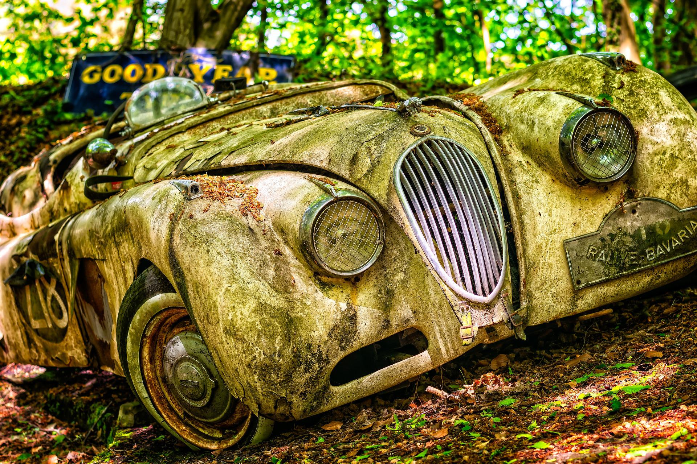
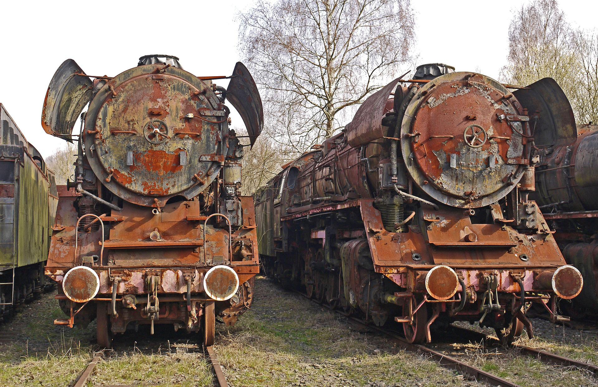
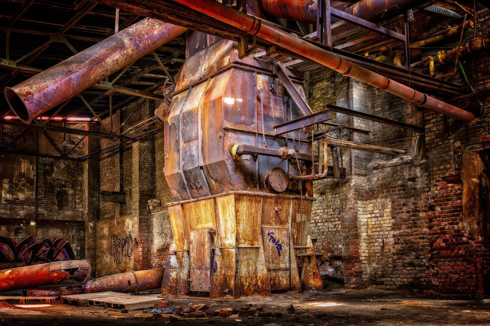

<style>
/* Global style */

section.main-heading h1 {
    font-size: 400%;
    position: absolute;
    bottom: 0.5em;
    right: 1em;
}
section.main-heading-top h1 {
    font-size: 400%;
    position: absolute;
    top: 0.5em;
    left: 1em;
}
section.main-heading-top h2 {
    position: absolute;
    top: 0em;
    left: 1em;
}
section.h1-white h1 {
    color: white;
}
section.title-shadow-red h1 {
    text-shadow: 0 0 15px rgba(255,0,0,.5), 0 0 10px rgba(255,0,0,.5);
    /* https://html-css-js.com/css/generator/text-shadow/ */
}
section.title-shadow-white h1,
section.title-shadow-white h2 {
    text-shadow: 0 0 20px rgba(255,255,255,.8), 0 0 15px rgba(255,255,255,.8);
    /* https://html-css-js.com/css/generator/text-shadow/ */
}
</style>

<!-- _class: main-heading-top h1-white -->

<style scoped>
h6 {
    position: absolute;
    bottom: 0;
    right: 1rem;
    color: white;
}
</style>


<!-- _class: main-heading-top h1-white -->

<style scoped>
    h1, h6 {
        color: rgba(255,255,255,0.9);
        text-shadow: 0 0 15px rgba(255,0,0,.5), 0 0 10px rgba(255,0,0,.5);
        /* https://html-css-js.com/css/generator/text-shadow/ */
    }
    h6 {
        position: absolute;
        bottom: 0;
        right: 1rem;
    }
    a {
        text-decoration: none;
        color: inherit;
    }
</style>

# Cargo ou comment étendre le tooling Rust à l'infini !
###### Anthony Pena - https://k49.fr.nf


<!-- https://pixabay.com/photos/highway-traffic-long-exposure-393492/ -->


---

# Un peu d'histoire


<!--
- Rust a été créé par une personne seule (Graydon Hoare) en 2006
- à partir de 2009 Mozilla (son employeyr) s'y intéresse
- Mozilla révèle Rust en 2010
- En 2010 le compilateur écrit en OCaml est abandonné pour un compilateur écrit en Rust
- Depuis février 2021, le langage est porté par la Fondation Rust (fondé par AWS, Huawei, Google, Microsoft et Mozilla)

-->

---

<!-- _class: title-shadow-red -->
<style scoped>
    img {
        display: block;
        margin: auto;
        background-color: transparent;
    }
</style>

# Rustaceans (like Crustacean but with some Rust)


<!--
- La mascotte s'appelle Ferris
- C'est un crustacés (en anglais Crustacean)
- les gens qui font du Rust s'appelle donc les Rustaceans

-->

---

<!-- _class: title-shadow-red -->

# Rust un langage moderne


---
<style scoped>
    h1:first-of-type {
        padding-top: 12rem;
    }
    h1 {
        text-align: center;
    }
</style>

# Performant

<!--
- rapide et efficace en mémoire
- pas de runtime ou de garbage collector
- efficace en consommation de ressources
- peut être utilisé en embarqué
-->




--- 

# Fiable

<!--
- système de type riche
- ownership et le modèle de partage mémoire et thread
- le tout à la compilation
-->



---

# Productif

<!--
- bonne documentation
- message d'erreur compréhensible et bien détaillé et qui pointe vers la doc
- outillage assez complet de base
- intégration IDE
-->



---

<!-- _class: title-shadow-red -->
<style scoped>
    h1 {
        text-align: right;
    }
</style>

# Hello, world!


---

<!-- _class: title-shadow-white -->

# mais aussi...


---

```Rust
if foo == "SFEIR" {
    // do something
}

for i in 0..10 {
    // do something
}

const check: u8 = if foo == "SFEIR" {
    1
} else {
    0
};
```

<!-- moins de parenthèses ! -->

---

```Rust

type City = String;
type Year = u16;

enum Conf {
    Devfest(City, Year),
    Devoxx(Year),
    None,
}

```

<!--

- type alias
- enum = ADT / algebraic data types
- struct

-->
---

```Rust

fn match_conf(conf: Conf) -> String {
    match conf {
        Devfest(city, year) => format!("Devfest {} {}", city, year),
        Devoxx(year @ 2020..) => format!("Devoxx {}", year),
        Devoxx(year) => format!("Devoxx {}", year),
        None => format!("-")
    }
}

```

<!--

- match remplace le switch
- est aussi expression comme le if
- return automatic sur la dernière instruction
-->

---

<!-- _class: title-shadow-white -->

# Et encore beaucoup d'autres points...


---

<!-- _class: title-shadow-red -->

# Tooling


---

## Rustup

```bash
rustup toolchain install stable # installer une toolchain
rustup update                   # la mettre à jour
rustup default nightly          # changer de toolchain
```

<!--
- nvm / sdkman => rustup
    - pour setup et gérer sa toolchain rust sans prise de tête

-->

---

<!-- _class: title-shadow-red -->

# Cargo


---

<!-- _class: title-shadow-white -->

# `cargo init`


---

<!-- _class: title-shadow-white -->

# `cargo install` + `cargo update`


---

<!-- _class: title-shadow-white -->

# `cargo package` + `cargo publish`


---

<!-- _class: title-shadow-white -->

# `cargo run`


---

<!-- _class: title-shadow-white -->

# `cargo test`
## pour faire des tests de perfs `cargo bench`


---

<!-- _class: title-shadow-white -->

# `cargo build`
## pour aller en prod `cargo build --release --locked` 


---

<!-- _class: title-shadow-white -->

# `cargo fmt`


---

<!-- _class: title-shadow-white -->

# `cargo clippy`


<!-- linter -->

---

<!-- _class: title-shadow-white -->

# `cargo fix`


<!-- Pour les plus feinéant : un fix auto des warnings -->

---

<!-- _class: title-shadow-white -->

# `cargo hello` ?


---

# Conclusion


<!--

- Rust est un super langage
- c'est pas simple au début mais le compilateur aide beaucoup
    - même si il est un peu comme Retsuko : il râle très fort, il doit nous haïr profondément mais il semble gentil en nous expliquant les choses
- le tooling est top
- la doc est top aussi

-->
---

<style scoped>
h3 {
   display: flex;
   align-items: end; 
}
h4:not(:first-child) {
    margin-top: 0;
}
h4 img {
    max-width: 2em;
    max-height: 0.9em;
    display: inline-block;
    vertical-align: middle;
}
section {
    background: url(img/social/axolotl-bg.png) white no-repeat bottom -60px right -55px;
    background-size: 35%;
}
figure img {
    /* Ça marche pas mais c'est le style pour avoir l'image de gauche en biseau plutôt qu'avec un cut vertical droit */
    clip-path: polygon(0px 0px, 100% 0px, 80% 100%, 0px 100%);
}
</style>


# Anthony Pena
### Développeur Web Fullstack @ 

####  @\_Anthony\_Pena\_
####  @kuroidoruido
####  @penaanthony
#### https://k49.fr.nf
#### https://github.com/kuroidoruido/talks

---


---

# Crédit photos

- https://pixabay.com/users/tama66-1032521
    - fond de la slide de démarrage
    - fond diapos titre
    - usine abandonnée
- https://pixabay.com/photos/lost-place-lokfriedhof-rust-3163912/
    - train rouillé
- Kaamelott
    - Photo du Père Blaise
