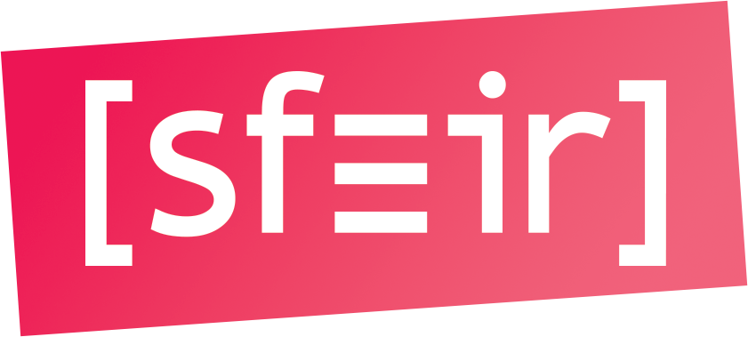

<!-- _class: main-heading-top h1-white -->

<!-- _class: main-heading-top h1-white -->

# Cargo ou comment étendre le tooling Rust à l'infini !
###### Anthony Pena - https://k49.fr.nf

<!-- https://pixabay.com/photos/highway-traffic-long-exposure-393492/ -->

---

# Un peu d'histoire

<!--
- Rust a été créé par une personne seule (Graydon Hoare) en 2006
- à partir de 2009 Mozilla (son employeyr) s'y intéresse
- Mozilla révèle Rust en 2010
- En 2010 le compilateur écrit en OCaml est abandonné pour un compilateur écrit en Rust
- Depuis février 2021, le langage est porté par la Fondation Rust (fondé par AWS, Huawei, Google, Microsoft et Mozilla)

-->

---

# Rustaceans (like Crustacean but with some Rust)

<!--
- La mascotte s'appelle Ferris
- C'est un crustacés (en anglais Crustacean)
- les gens qui font du Rust s'appelle donc les Rustaceans

-->

---

- Rust est un langage prévu pour être : 
    - Performant
        - rapide et efficace en mémoire
        - pas de runtime ou de garbage collector
        - efficace en consommation de ressources
        - peut être utilisé en embarqué
    - Fiable
        - système de type riche
        - ownership et le modèle de partage mémoire et thread
        - le tout à la compilation
    - Productif
        - bonne documentation
        - message d'erreur compréhensible et bien détaillé et qui pointe vers la doc
        - outillage assez complet de base
        - intégration IDE

- nvm / sdkman => rustup
    - pour setup et gérer sa toolchain rust sans prise de tête

- avec d'autres langages on a l'habitude d'empiler les outils pour travailler, avec cargo c'est magique
    - init => cargo init
    - tests : jest/jasmine/etc. / junit => cargo test
    - lancer : npm run / mvn exec / gradle run => cargo run
    - compiler : tsc / webpack / javac / ... => cargo build
    - formatter : prettier / java ? => cargo fmt
    - lint : tslint/eslint/sonar => cargo clippy
    - etc.

- 

---

# Anthony Pena
### Développeur Web Fullstack @ 

####  @\_Anthony\_Pena\_
####  @kuroidoruido
####  @penaanthony
#### https://k49.fr.nf

---

# Crédit photos

- https://pixabay.com/users/tama66-1032521
    - fond de la slide de démarrage
- Kaamelott
    - Photo du Père Blaise
