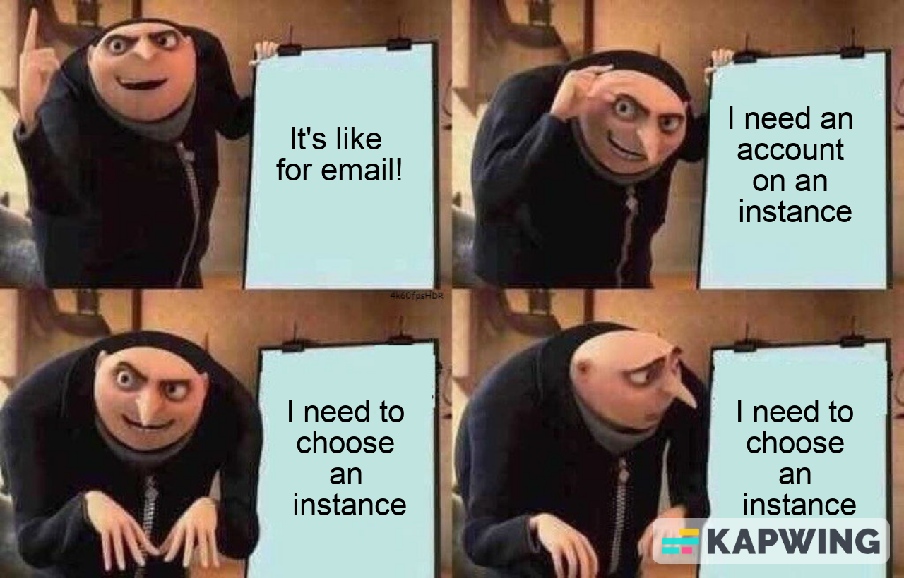
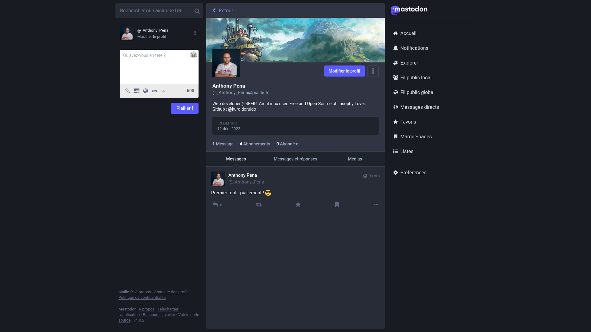

# On vit déjà dans un monde fédéré !

###### Anthony Pena

---

# Qui pense utiliser des applications/outils/systèmes **centralisé** au quotidien ? 

---

# Qui pense utiliser des applications/outils/systèmes **décentralisé** au quotidien ? 

---

# Qui pense utiliser des applications/outils/systèmes **fédérés** au quotidien ? 

---

# Réseau centralisé

<!--
- on a un point d'entrée unique
- ça peut-être un ensemble de serveur / un ensemble de datacenter / un cloud
- mais c'est contrôlé par une seule entité (une personne, une entreprise, une fondation)
-->

---

# "Je vais sur twitter.com comme tout le monde !"

---

# Réseau décentralisé

<!--
- aucun point d'entrée
- il faut installer un logiciel spécial
- on doit savoir avec qui on veut échanger des données / communiquer
-->
---

# "Pourquoi je dois installer un logiciel spécial... ?"

---

# Réseau décentralisé avec tracker

<!--
- on a potentiellement plusieurs points d'entrées
- mais il faut toujours installer un logiciel spécial
- on a pas besoin de savoir avec qui échanger des données / communiquer
-->
---

## "Quoi le .torrent c'est pas mon film ?
# Je fais comment du coup ?"

---

# Réseau fédéré

<!--
- on a plusieurs points d'entrées, potentiellement chacun le sien
- pas forcément besoin d'un logiciel dédié
- les fédérations discutent entre elles et savent comment communiquer
-->

---

---

# Le cas de Mastodon

<!--

- Basé sur un protocol standardisé W3C qui s'appelle ActivityPub
- Standard validé le 23 janvier 2018
- Ce protocol est utilisé par d'autres outils comme PeerTube (pleins d'autres mais moins connu)
- Aucun grand acteur ne s'est emparé du standard
- Le propriétaire est maitre

-->

---

# Un point sur la modération

<!--

- 1 instance = ses propres règles
- les instances FR sont soumises au droit FR dans tous les cas
- le propriétaire de l'instance est responsable pénalement
- pas d'équipe de modération à priori
- chacun peut signaler
- le propriétaire peut bannir certaines instances

-->

---

# Viendez toot with me!

---

# Merci !

---

Crédit photo:
- https://pixabay.com/illustrations/network-internet-communication-3357642/
- https://pixabay.com/illustrations/big-data-information-data-numbers-7645261/
- https://unsplash.com/fr/photos/mWvG5wGJq6U
- https://unsplash.com/fr/photos/WrvKaKkDzW4
- https://pixabay.com/photos/traffic-control-police-characters-3168603/