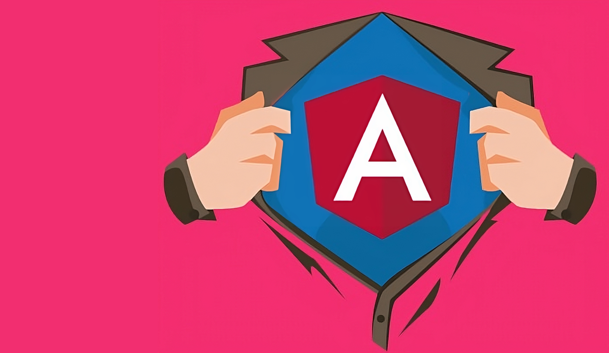
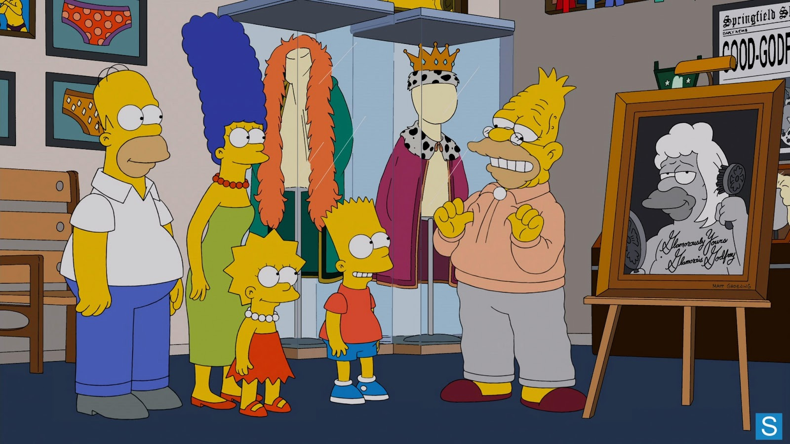
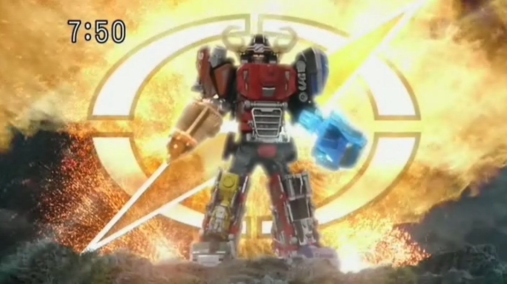
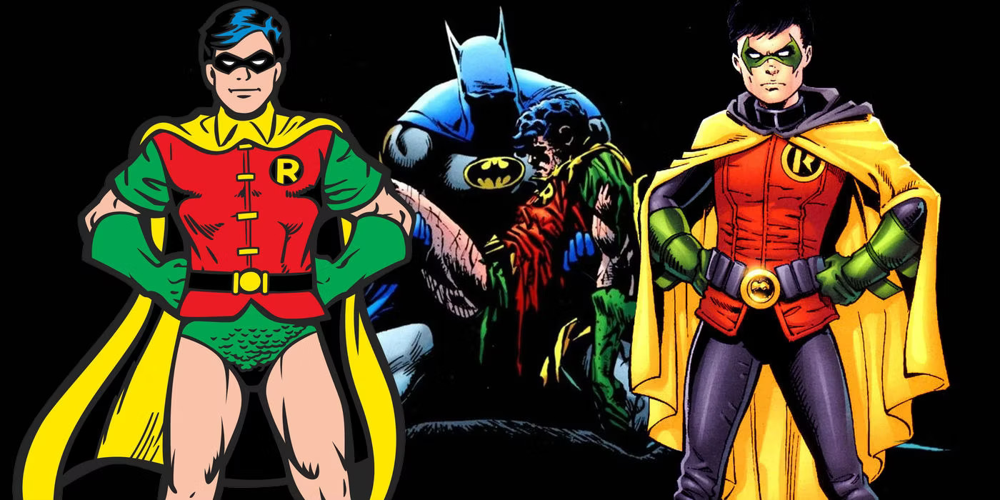

<!-- _class: main-heading-top h1-white -->

# Battle' Front : Angular

###### Anthony Pena - https://k49.fr.nf

---

<!-- _class: main-heading h1-white -->

# Le plus vieux

<!--
- le plus vieux de framework front
- se base sur AngularJS sortie en 2009
- Angular est sortie en 2016

- React c'est 2013
- Vue c'est 2014

-->

---

<!-- _class: main-heading h1-white -->

# Le plus complet

<!--
MAIS :

- on le connait bien
- on peut avoir confiance sur le fait qu'il vive dans le temps
- framework complet et mature à la façon d'un Spring dans le monde Java
- on retrouve tout ce qu'il faut d'outillage : router, http client, reactivité, i18n, structure de projet (hiérarchie des dossiers, découpages des fichiers, injection de dépendance, etc.), CLI avec projet clé en main, etc.
-->

---

<!-- _class: main-heading h1-white -->

# Le plus évolutif

<!--

- l'équipe a aussi appris de ses erreurs
- beaucoup de critique et problème avec AngularJS
- du coup le CLI encaisse 99% des montées de version tout seul
- le but c'est de ne jamais casser pour ne jamais reproduire le passage de AngularJS à Angular 2

Exemple de RxJS 5 à 6 complètement pris en charge par le CLI

-->

---

<!-- _class: main-heading h1-white -->

# Le plus moderne

<!--

- On entend pas mal de mauvaise langue dire que rien ne bouge
- mais ça bouge sous le capot depuis toujours
- ça bouge aussi en surface depuis 2 ans
- on entre dans la 3 ème ère d'Angular et elle s'installe sans aucune casse avec :
    - les standalone components
    - beaucoup d'API qui bascule en function
    - les Signals
    - nouveau control flow (ng conf y'a un peu plus d'1 semaine)
-->

---

<!-- _class: main-heading h1-white -->

# Pour l'efficacité

<!--

- c'est un vrai outil pensé pour être productif et se concentrer sur le métier qu'on développe
- "je laisse mes collègues se chamailler en comparant leurs frameworks, avec eux vous aurez tout le loisir de jouer"
- Angular est pensé pour que tout soit prêt pour vos besoins sans prise de tête
-->

---

