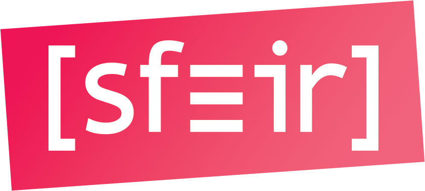

<!-- _class: main-heading-top h1-white -->

# Rendez votre application web réactive à l'environnement !

###### Anthony Pena - https://k49.fr.nf

---
---

# Anthony Pena
### Développeur Web Fullstack @ 

####  @\_Anthony\_Pena\_
####  @kuroidoruido
####  @penaanthony
#### https://k49.fr.nf
#### https://github.com/kuroidoruido/talks

---

