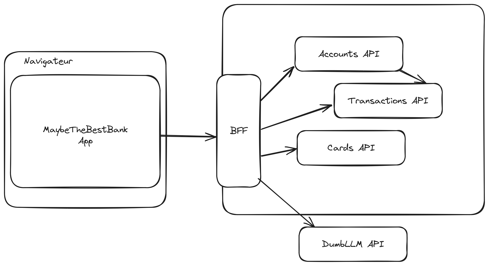
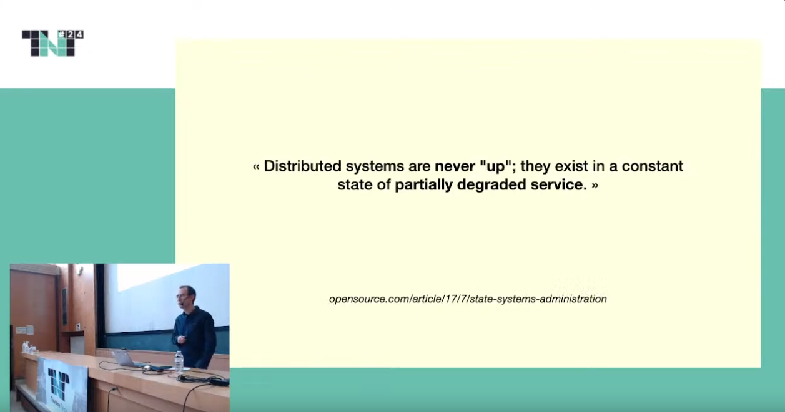

<style>
/* Global style */

section.main-heading h1 {
    font-size: 400%;
    position: absolute;
    bottom: 0.5em;
    right: 1em;
    text-shadow: #000 0px 0 10px;
}
section.main-heading-top h1 {
    font-size: 300%;
    position: absolute;
    top: 0.5em;
    left: 1em;
    text-shadow: #000 0px 0 10px;
}
section.main-heading-top h2 {
    position: absolute;
    top: 0em;
    left: 1em;
}
section.h1-white h1 {
    color: white;
}
section:not(.main-heading):not(.main-heading-top) h1 {
    background-color: rgba(255,255,255,0.8);
    width: fit-content;
    padding: .3em 1em;
}

</style>

<!-- _class: main-heading-top h1-white -->

<style scoped>
h6 {
    position: absolute;
    bottom: 0;
    right: 1rem;
    color: white;
}
a {
    color: white;
}
</style>

# Rendez votre application React réactive à l'environnement !

###### Anthony Pena - https://k49.fr.nf


<!--
---


<! -- 
- Qui est frontend ? fullstack ? backend ?
- vous hoster sur un apache/nginx ? via votre backend ? via CDN ? autre ?
- Imaginons que votre backend est cassé, c'est page blanche chez vous ?
- Et si c'est un des services appelé par votre backend ? votre app continue d'être utilisable ? 
-->

<!-- Crédit photo : https://www.aspire.org/2018/08/16/who-are-you/ -->

---


# C'est quoi une "app React" ?

<!--
- SPA
- utilisé dans la durée
- par opposition aux "sites web"

-->

<!-- Crédit photo : https://pixabay.com/photos/question-question-mark-opinion-poll-2736480/ -->

---


# C'est quoi l' "environnement" ?

<!--
- le/les backend(s)
- le réseau
- les services tiers
- la configuration dynamique
- l'analytics
- un feu dans un datacenter

- en gros : tout le contexte de notre app

-->

<!-- Crédit photo : https://unsplash.com/fr/photos/arbres-forestiers-marques-de-points-dinterrogation-i--IN3cvEjg-->

---


# La base : configuration à la compilation

<!--
- environment.ts en Angular
- .env dans pas mal de projet
- on doit tout recompiler / rejouer les pipelines / redéployer pour changer quoi que ce soit

-->

<!-- Crédit photo : https://pixabay.com/photos/tombstone-dig-graveyard-stone-grim-2196283/ -->

---

# Archi du projet démo



<!-- DEMO : avec le VITE_ENV_DEBUG --> 

---


# Configuration dynamique

<!--
- charger /config.json
- on va y trouver globalement "comment taper le backend"
- je préfère un json plutôt qu'un js
    - pas d'exécution de code
    - pas de polution de window.
    - on a quelque chose de typé côté TypeScript sans devoir retyper Window
- il faut penser à avoir une configuration par défaut pour le cas où on arriverait pas à charger le config.json
- attention aux caches ! CDN / APIM / Load Balancer

- Selon vous : on le charge quand le config.json ?

DEMO : avec la backend URL
- changer le port en live du BFF
- changer la config.json sans redémarrer le front

-->

<!-- Crédit photo : https://unsplash.com/fr/photos/vehicule-gris-en-cours-de-fixation-a-linterieur-de-lusine-a-laide-de-machines-robotisees-jHZ70nRk7Ns -->

---


# Toggles Features

<!--

- Est-ce que tout le monde connait ? Si non expliquer
    - Pouvoir activer/désactiver une feature déjà livrée
    - ne pas bloquer de livraison
    - ne pas avoir à relivrer pour activer/désactiver une feature
        - et donc décorreller livraison et activation d'une feature
- Un basique /toggle.json fonctione bien
    - on peut prendre un outil plus avancer comme Izanami de la MAIF ou ff4j

- Selon vous : on le charge quand le toggle.json ?

DEMO : activer/désactiver l'assistant

-->

<!-- Crédit photo : https://pixabay.com/photos/switches-gauges-control-equipment-923072/ -->

---


# Backend toggle ? HATEOAS ?

<!--

- HATEOAS est souvent oublié de base
- Mais avec HATEOAS on peut déjà faire en sorte de désactiver des features
- plus besoin de le faire côté front + côté backend
    - que côté front c'est pas safe

-->

<!-- Crédit photo : https://fr.wikipedia.org/wiki/Espace_liminal -->


---


# HATEOAS : édition activé

```JSON
{
    "cards": [{
        "cardId": 300045,
        "links": [
            {
                "href": "cards/300045/",
                "rel": "edit-form",
                "type" : "PUT"
            }
        ]
    }]
}
```


---


# HATEOAS : édition désactivé

```JSON
{
    "cards": [{
        "cardId": 300045
    }]
}
```


---


# Oups c'est cassé…

<!--

- Les toggles c'est cool, on peut couper une feature
- Mais si un service annexe tombe quand l'équipe est off ? la nuit/le week-end ?


-->

<!-- Crédit photo : https://pixabay.com/photos/bicycle-retro-broken-old-nostalgia-2197007/ -->

---



<!--

- plus notre système grossi, plus la chance que tout soit up en même temps réduit
- Pascal Martin en parle dans son talk "Une application résiliente, dans un monde partiellement dégradé"
-->

---

<style scoped>
    h1:first-child {
        margin-bottom: 0;
    }
    h1:last-child {
        margin-top: 0;
        padding-left: 18rem
    }
</style>


# Tester la santé de vos backends
# **avant les utilisateurs** 

<!--

- Ajouter une route /health sur tous vos services
- Lui faire retourner la santé
- Faire ça pour tout l'arbre d'API
- On peut connaitre l'état du SI dynamiquement
- On peut adapter l'UI à la santé de notre SI
- Peut-être que l'API de carte banquaire est cassé mais que celle avec les transactions est up ?

DEMO : montré le cut de la cards-api (9300)
- le point de santé passe en jaune
- tout fonctionne sauf la partie cartes

-->

<!-- Crédit photo : https://pixabay.com/photos/monitoring-life-monitor-ekg-4939621/ -->

---


# Retry + Exponential backoff ?

<!--

- avoir une politique de retry
- attention à l'engorgement

DEMO :
- 1 chance sur 6 d'avoir une erreur sur l'appel à l'api transaction
- rien de visible grâce au retry

-->

<!-- Crédit photo : https://pixabay.com/photos/wind-kite-blue-sky-air-loop-391870/ -->

---


# Être proactif à la lenteur ?

<!--

- être aggressif sur les timeouts
- on peut mesurer la lenteur
- possible de faire ça en JS en faisant un calcul sur le temps de chargement d'une resource dont on connait la taille

-->

<!-- Crédit photo : https://pixabay.com/photos/snail-shell-close-up-mollusk-slow-7945974/ -->

--- 

```
console.log(navigator.connection.type); 
        // bluetooth, cellular, ethernet, wifi, etc..


```

https://developer.mozilla.org/en-US/docs/Web/API/Network_Information_API


--- 

```
console.log(navigator.connection.type); 
        // bluetooth, cellular, ethernet, wifi, etc..
console.log(navigator.connection.effectiveType); 
        // slow-2g, 2g, 3g ou 4g


```

https://developer.mozilla.org/en-US/docs/Web/API/Network_Information_API


--- 

```
console.log(navigator.connection.type); 
        // bluetooth, cellular, ethernet, wifi, etc..
console.log(navigator.connection.effectiveType); 
        // slow-2g, 2g, 3g ou 4g
console.log(navigator.connection.rtt); 
        // 25ms
```

https://developer.mozilla.org/en-US/docs/Web/API/Network_Information_API

<!--

- Chrome only (rejected par Firefox et Safari)
- Encore expérimentale car non standardisé
- Permet d'avoir une vue conditionnée à la connexion de l'utilisateur

-->

---


# Accepter des données moins à jour pour continuer à servir l'utilisateur ?

<!--

- exemple de Accounts-api qui donne les 3 dernières transactions
    - ça peut suffir à l'utilisateur même si c'est pas parfaitement à jour

-->

<!-- Crédit photo : https://pixabay.com/photos/collector-documents-office-folder-3930337/ -->

---

<style scoped>
h3 {
   display: flex;
   align-items: end; 
}
h4:not(:first-child) {
    margin-top: 0;
}
h4 img {
    max-width: 2em;
    max-height: 0.9em;
    display: inline-block;
    vertical-align: middle;
}
section {
    background: url(img/social/axolotl-bg.png) white no-repeat bottom -60px right -55px;
    background-size: 35%;
}
figure img {
    /* Ça marche pas mais c'est le style pour avoir l'image de gauche en biseau plutôt qu'avec un cut vertical droit */
    clip-path: polygon(0px 0px, 100% 0px, 80% 100%, 0px 100%);
}
img[alt="angular-devs.fr"] {
    width: 5rem;
    display: inline;
}
</style>


# Anthony Pena
### Développeur Web Fullstack @ 

####  @\_Anthony\_Pena\_
####  @kuroidoruido
####  @penaanthony
#### https://k49.fr.nf
#### https://github.com/kuroidoruido/talks


---

