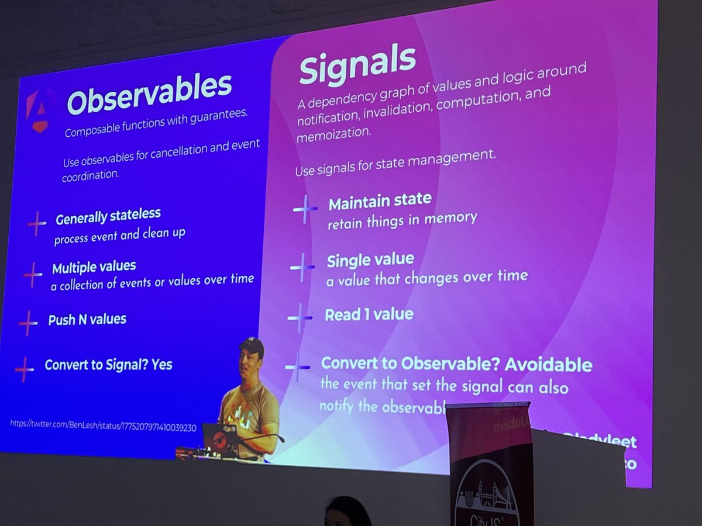

<style>
/* Global style */

section.main-heading h1 {
    font-size: 400%;
    position: absolute;
    bottom: 0.5em;
    right: 1em;
    text-shadow: #000 0px 0 10px;
}
section.main-heading-top h1 {
    font-size: 300%;
    position: absolute;
    top: 0.5em;
    left: 1em;
    text-shadow: #000 0px 0 10px;
}
section.main-heading-top h2 {
    position: absolute;
    top: 0em;
    left: 1em;
}
section.h1-white h1 {
    color: white;
}
section:not(.main-heading):not(.main-heading-top) h1 {
    background-color: rgba(255,255,255,0.8);
    width: fit-content;
    padding: .3em 1em;
}

</style>

<!-- _class: main-heading-top h1-white -->

<style scoped>
h1 {
    text-align: center;
}
h6 {
    position: absolute;
    bottom: 0;
    right: 1rem;
    color: white;
    text-shadow: #000 0px 0 6px;
}
a {
    color: white;
}
</style>


# Adieu RxJS ! Vive les Signals ! Oh wait…

###### Anthony Pena


---

<style scoped>
h3 {
   display: flex;
   align-items: end; 
}
h4:not(:first-child) {
    margin-top: 0;
}
h4 img {
    max-width: 2em;
    max-height: 0.9em;
    display: inline-block;
    vertical-align: middle;
}
section {
    content: "";
    background: url(img/social/axolotl-bg2.png) white no-repeat top -80px left -70px;
    background-size: 35%;
}
figure img {
    /* Ça marche pas mais c'est le style pour avoir l'image de gauche en biseau plutôt qu'avec un cut vertical droit */
    clip-path: polygon(0px 0px, 100% 0px, 80% 100%, 0px 100%);
}
img[alt="angulardevs.fr"] {
    max-width: 5rem;
    max-height: 5rem;
    display: inline;
}
</style>


# Anthony Pena
### Développeur Web Fullstack @ 

 

---

# Avant les frameworks


<!--
- Avant 2010
- grosso modo vanilla ou jQuery
- on faisait tout à base de addEventListener
- donc on ne se basait que sur les events standard JS
- on écoutait des events mais pas plus que ça
- on mixait le "comment mettre à jour" avec les données et la vue
-->

---

# La Réactivité ?


<!--
- le fait de réagir ?
- un peu trop basic comme définition
-->

---

> "A declarative programming model for updating based on changes to state." Kristen / pzuraq

https://www.pzuraq.com/blog/what-is-reactivity

<!--
l'idée c'est de définir des données, les mapper et avoir un mécanisme qui réagit tout seul pour faire en sorte de synchroniser le tout
-->
---

# Angular.JS et ses watchers


<!--
- le père de tous les frameworks modernes
- fonctionnement à base de composant
- two-ways data-binding
    - on map une variable de notre composant dans la vue
    - à chaque changement de la variable on change la vue
    - si la vue bouge, on change les variables en conséquence aussi
    - on part exemple un input dont la value était mappé à une variable, on avait un binding dans les deux sens
- tout fonctionnait à base d'un système de watcher
    - ça marche tant que y'a pas grand chose à watch
    - c'est pas perf
    - plus y'a de watch plus c'est lourd et lent
-->

---

# Angular 2 et Zone.js


<!--
- avant Angular 2 on cherche à faire mieux
- fini le watch, on introduit Zone.js
- à chaque fois qu'il se passe un truc, Zone prévient Angular qu'il doit lancer une détection de changement
- là Angular fait le tour de tous les composants pour voir ce qui a pu changer (ce qu'on appelle la phase de "change detection")
- déclenche une mise à jour des composants qui ont bougés 
-->

---

```TypeScript

@Component({
  template: `
    <p>{{ text }}</p>
  `,
})
export class PlaygroundComponent {
  text = "";

  ngOnInit() {
      setInterval(() => this.text += '!', 1_000)
  }
}

```

<!-- # CODE SLIDE : avec l'édition d'une variable -->

---

```TypeScript

@Component({
  template: `
    <input (change)="setText($event)"/>
    <p>{{ text }}</p>
  `,
})
export class PlaygroundComponent {
  text = "";

  setText(event: Event) {
    this.text = (event.target as HTMLInputElement).value;
  }
}

```

<!-- # CODE SLIDE : avec l'édition d'un champ de texte -->

---

```TypeScript

@Component({
  template: `
    <input [(ngModel)]="text"/>
    <p>{{ text }}</p>
  `,
})
export class PlaygroundComponent {
  text = "";

  ngOnInit() {
      setInterval(() => this.text += '!', 1_000)
  }
}

```

<!-- # CODE SLIDE : avec du two-way data binding -->

---

```TypeScript

@Component({
  selector: 'app-root',
  standalone: true,
  template: `
    <p>{{ text }}</p>
  `,
})
export class PlaygroundComponent {
  text = "waiting...";

  ngOnInit() {
      this.asyncHello().then(text => this.text = text);
  }

  private asyncHello(): Promise<string> {
    // ...
  }
}

```

<!-- # CODE SLIDE : avec la résolution d'une promesse en mappant le retour -->


---

```TypeScript

@Component({
  template: `
    <p>{{ text | async }}</p>
  `,
})
export class PlaygroundComponent {
  text = this.asyncHello();

  private asyncHello(): Promise<string> {
    // ...
  }
}

```

<!-- # CODE SLIDE : avec la résolution d'une promesse en async pipe-->

---

# C'est cool tout ça non ?

---

# Oui mais Zone.js

<!--

- Zone vient monkey patch pleins d'API standard pour introduire une mécanique de notification d'appel (pour les setTimeout, les setter, les Promises, etc.)

- Zone ça fonctionne
    - c'est mieux que les watcher
    - mais on monkey patch beaucoup de choses
    - c'est lourd
    - y'a un système de contexte un peu bizarre
    - c'est un peu trop magique pour être facile à comprendre

- Angular + Zone c'est forcément du component level pour la réactivité

-->

---

# Angular 17 et les Signals

<!--
- experimental à partir de la v16
- stable en v17
- nouvelle mécanique pour la réactivité
- on ne se repose plus sur Zone pour la réactivité
- on ne fait plus de réactivité à l'échelle du composant mais d'une variable
    - ce qu'on appelle la "fine grained reactivity"
- le concept n'est pas nouveau, Solidjs l'a introduit en 2019
-->

---

# CODE SLIDE : reprendre la demo edition de variable mais en Signal

---

# CODE SLIDE : reprendre la demo edition de champ de texte mais en Signal

---

# CODE SLIDE : reprendre la demo promesse mais en Signal

---

# Signals <3

<!--
- rien de compliqué
- beaucoup plus léger
- plus de magie sur la gestion de l'asynchrone
-->

---

# Bientôt un standard

https://github.com/tc39/proposal-signals

<!--
- en passe d'être standardisé dans ECMAScript (stage 1)
- l'implémentation est simple
-->

---

# Zone.js c'est fini ?

<!--
- plus besoin de Zone
- en tout cas bientôt
- et on commence à pouvoir remplacer beaucoup de chose par des signals
-->

---

# CODE SLIDE : demo Signal input()

---

# CODE SLIDE : demo Signal output()

---

# CODE SLIDE : demo Signal viewchild()

<!--
- moins d'anotation
- moins de complexité dans les composants
-->

---

# Oups j'ai oublié RxJS dans tous ça 🙊 (non)

<!--
- Pas besoin de RxJS pour les composants
- RxJS n'est utilisé (en tout cas pas visible) dans la réactivité en Angular
-->

---

# Mais au fait... C'est quoi RxJS ?

---

# RxJS = ReactiveX for JavaScript = librairie pour traiter des flux d'évènements

<!--
- avec les Signals on parlait de reactivité et d'état
- avec RxJS on parle stream et event
- le but de RxJS c'est de nous donner une API haut niveau pour gérer des données sur un flux, les combiner, transformer, filtrer, faire du rejeux, etc.
- aucune notion d'UI
    - RxJS peut très bien s'utiliser côté backend !
        - typiquement NestJS est en grande partie basé sur RxJS
-->

---

# Parlons Observable

<!--
- un Observable est stateless
- un Observable est lazy
- un Observable est purement fonctionnel et "immutable"
-->

---

# CODE SLIDE : demo Signal + Observable toSignal() toObservable()

<!--
- on a des ponts faciles au besoin entre RxJS et les Signals quand même
- par exemple :
    - si vous avec une NgRx qui est une store reactif à base d'RxJS
    - pour les appels http avec HttpClient
-->

---

# Montrer les limitations des Signals

---



---

# Prendre le cas du HttpClient et des interceptors qui sont entièrement basés sur RxJS

---

# Montrer par l’exemple de quand utiliser les Signals et quand utiliser RxJS

---

# Les Signals c'est pour gérer les états et la réactivité dans les composants

---

# RxJS est là pour gérer tous vos flux de données

---

<style scoped>
h3 {
   display: flex;
   align-items: end; 
}
h4:not(:first-child) {
    margin-top: 0;
}
h4 img {
    max-width: 2em;
    max-height: 0.9em;
    display: inline-block;
    vertical-align: middle;
}
section {
    background: url(img/social/axolotl-bg.png) white no-repeat bottom -60px right -55px;
    background-size: 35%;
}
figure img {
    /* Ça marche pas mais c'est le style pour avoir l'image de gauche en biseau plutôt qu'avec un cut vertical droit */
    clip-path: polygon(0px 0px, 100% 0px, 80% 100%, 0px 100%);
}
img[alt="angulardevs.fr"] {
    width: 5rem;
    display: inline;
}
</style>


# Anthony Pena
### Développeur Web Fullstack @ 

####  @\_Anthony\_Pena\_
####  @kuroidoruido
####  @penaanthony
#### https://k49.fr.nf
#### https://github.com/kuroidoruido/talks

 

---

