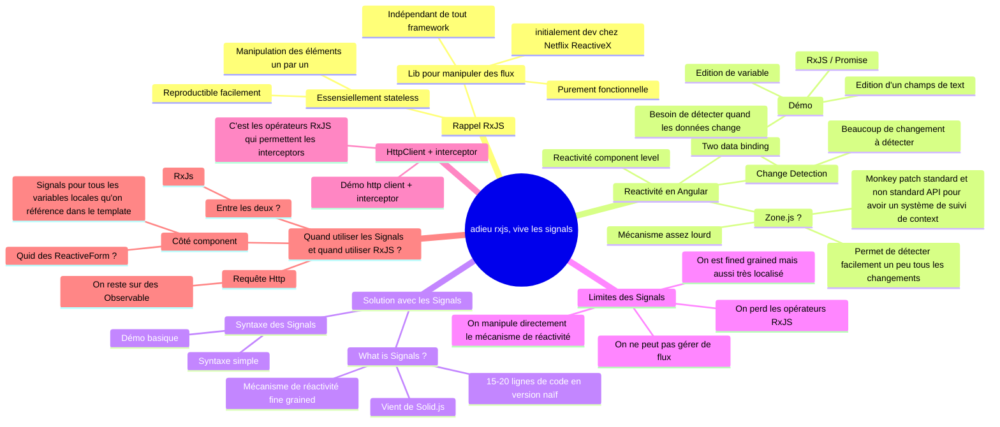

```mermaid
mindmap
    root((adieu rxjs, vive les signals))
        Rappel RxJS
            Lib pour manipuler des flux
                initialement dev chez Netflix ReactiveX
                Purement fonctionnelle
                Indépendant de tout framework
            Essensiellement stateless
                Manipulation des éléments un par un
                Reproductible facilement
        Reactivité en Angular
            Two data binding
                Démo
                    Edition de variable
                    Edition d'un champs de text
                    RxJS / Promise
            Change Detection
                Besoin de détecter quand les données change
                Beaucoup de changement à détecter
            Zone.js ?
                Monkey patch standard et non standard API pour avoir un système de suivi de context
                Mécanisme assez lourd
                Permet de détecter facilement un peu tous les changements
            Reactivité component level
        Solution avec les Signals
            What is Signals ?
                15-20 lignes de code en version naïf
                Mécanisme de réactivité fine grained
                Vient de Solid.js
            Syntaxe des Signals
                Démo basique
                Syntaxe simple
        Limites des Signals
            On manipule directement le mécanisme de réactivité
            On est fined grained mais aussi très localisé
            On ne peut pas gérer de flux
            On perd les opérateurs RxJS
        HttpClient + interceptor
            C'est les opérateurs RxJS qui permettent les interceptors
            Démo http client + interceptor
        Quand utiliser les Signals et quand utiliser RxJS ?
            Côté component
                Signals pour tous les variables locales qu'on référence dans le template
                Quid des ReactiveForm ?
            Requête Http
                On reste sur des Observable
            Entre les deux ?
                RxJs
```