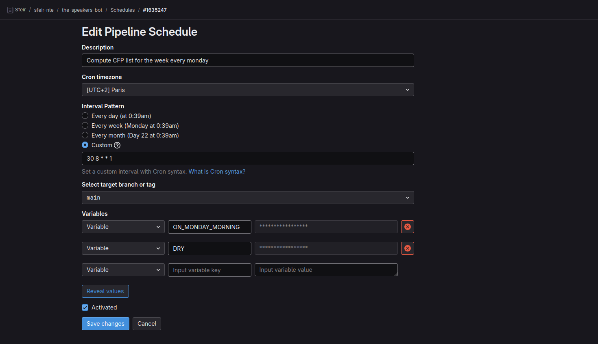

<style>
/* Global style */

section.main-heading h1 {
    font-size: 400%;
    position: absolute;
    bottom: 0.5em;
    right: 1em;
    text-shadow: #000 0px 0 10px;
}
section.main-heading-top h1 {
    font-size: 300%;
    position: absolute;
    top: 0.5em;
    left: 1em;
    text-shadow: #000 0px 0 10px;
}
section.main-heading-top h2 {
    position: absolute;
    top: 0em;
    left: 1em;
}
section.h1-white h1 {
    color: white;
}
section:not(.main-heading):not(.main-heading-top) h1 {
    background-color: rgba(255,255,255,0.8);
    width: fit-content;
    padding: .3em 1em;
}

</style>

<!-- _class: main-heading-top h1-white -->

<style scoped>
h1 {
    text-align: center;
}
h6 {
    position: absolute;
    bottom: 0;
    right: 1rem;
    color: white;
    text-shadow: #000 0px 0 6px;
}
a {
    color: white;
}
footer {
  display: none;
}
</style>

# Comment créer des bots GChat facilement pour pas kopeck ?

###### Anthony Pena


---


---

# Step 1 : Récupérer des données

---

```Bash
curl https://api.openai.com/v1/chat/completions \
-H "Content-Type: application/json" \
-H "Authorization: Bearer $OPENAI_API_KEY" \
-d '{
        "model": "gpt-4o",
        "messages": [
            {"role": "user", "content": "Raconte moi une blague en français"}
        ]
    }'
```

---

# Step 2 : Exécuter périodiquement

---

# Est-ce que vous avez en tête un service qui permet de lancer du code arbitraire à la demande ou avec un cron ? 🧐

---

```Yaml
default:
  image: node:latest
  before_script:
    - npm ci --cache .npm --prefer-offline
  cache:
    key: ${CI_COMMIT_REF_SLUG}
    paths:
      - .npm/

stages:
  - send-message

send-message:
  stage: send-message
  script:
    - npm run start
```

---



---

# Step 3 : envoyer un message sur GChat

---

```Bash
curl $GCHAT_WEBHOOK \
-X POST \
-H "Content-Type: application/json; charset=UTF-8" \
-d '{
        "text": "En direct live du SFEIR Share du 09/10/2024! 🖨️"
    }'
```

## So easy! 🤯

---

# On package tout ça ?

---

<style scoped>
    h1 {
        margin: auto;
    }
</style>

# npm i [@anthonypena/simple-bot](https://www.npmjs.com/package/@anthonypena/simple-bot) 🤖


---

```TypeScript
const jokeBot = createBot({
    name: 'Joke-Bot 🤖',
    trigger: always(),
    data: someData<{ ia: { message: GptMessage }[] }>({
        joke: gpt({
            messages: [{
                role: 'user',
                content: `Raconte moi une blague en français`,
            }]
        }),
    }),
    message: ({ botName, data: { joke } }) => `${joke}\n\n-- ${botName}`,
    emitter: dispatch(googleChat({ spaceUrl: process.env.GCHAT_WEBHOOK }))
})
```

---

```TypeScript
createBotSpace([
    jokeBot
], { env: process.env }).run()
```
