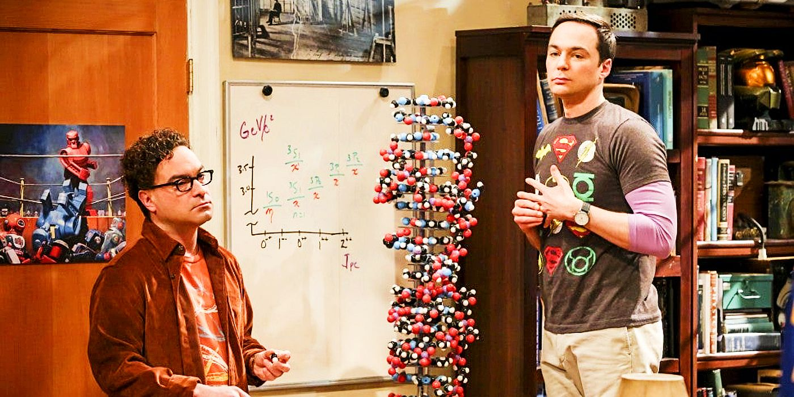
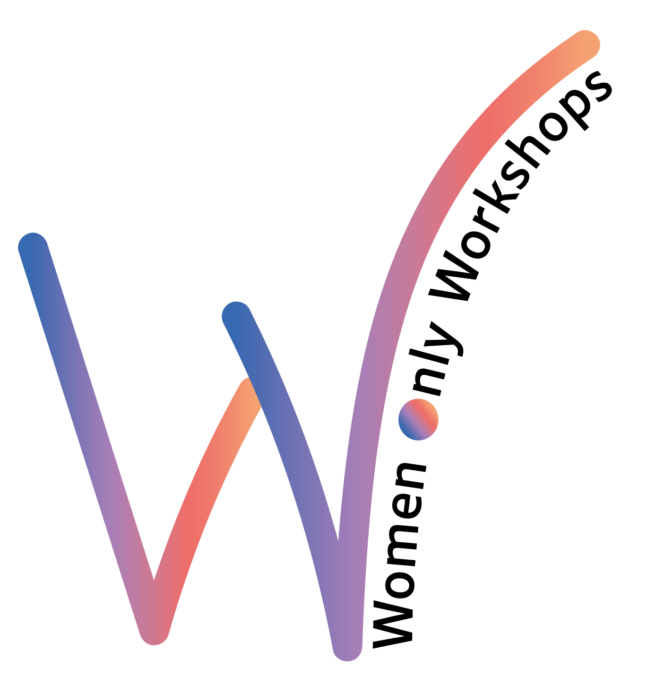
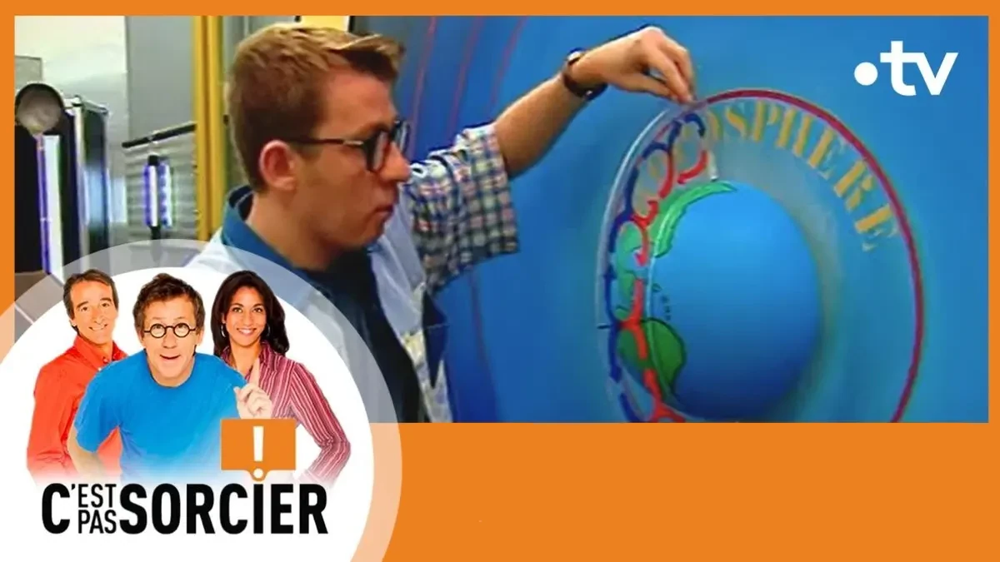
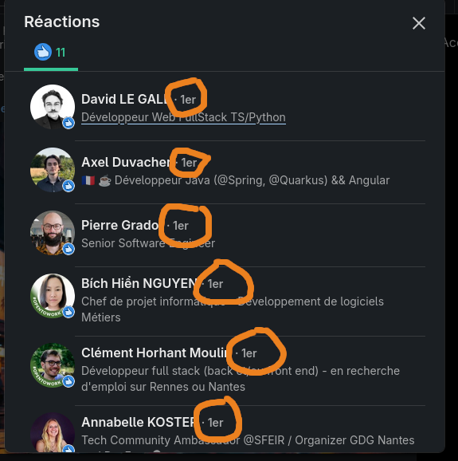
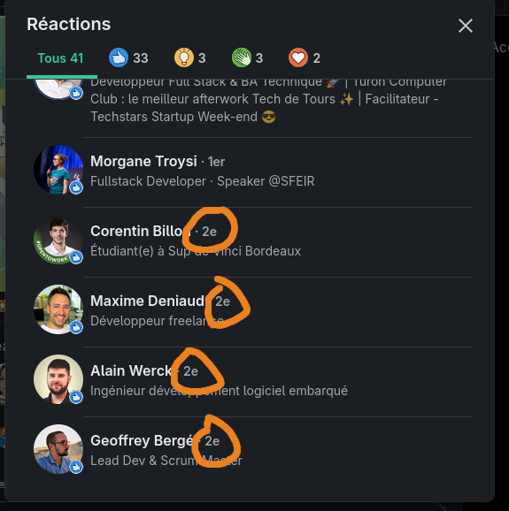
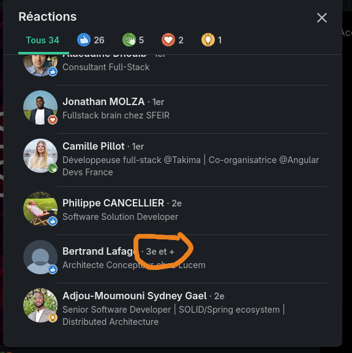
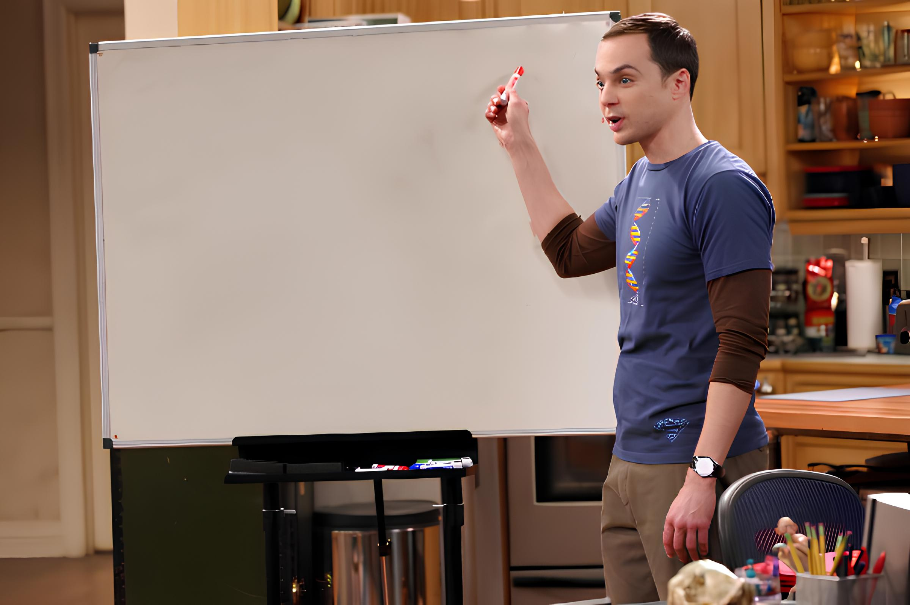
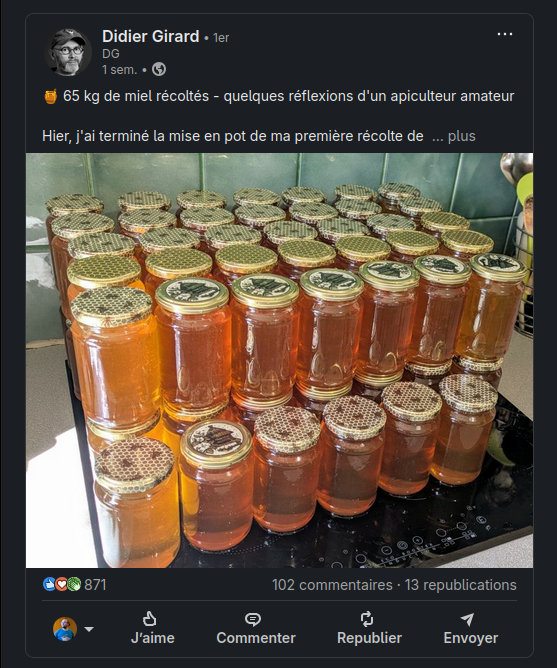
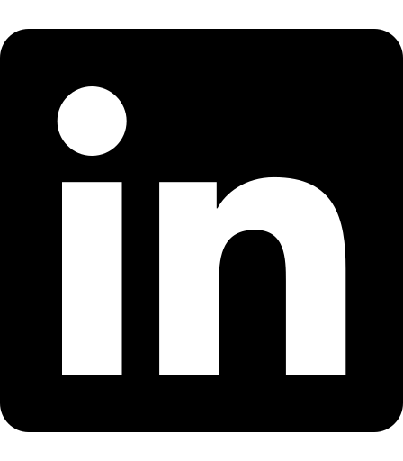

<!-- _class: main-heading-top h1-white -->

# Comment faire le post LinkedIn parfait ?

###### Anthony Pena

---

# Anthony Pena
### Développeur Web Fullstack @ 

  

---

# Pourquoi vouloir poster sur LinkedIn ?

<!--

- Facile d'avoir un gros réseau
    - je suis passé de 300-400 connexions à 1000-1200 en quelques mois
    - monter à 3000 en même pas 1 an de plus
    - la plupart des gens acceptent les demandent venant de personnes tech
- Des gens recherchent du contenu / des events sur ce réseau
- post long donc "facile" à construire
- la durée de vie des posts qui est d'environ 1 semaine n'impose pas d'avoir un réseau hyper grand pour percer
- les règles de fonctionnement reste encore "simple"

-->

---

# Diffuser autre chose que du bullshit...

<!--

- LinkedIn c'est aujourd'hui beaucoup de post bullshit
- Diffuser du vrai contenu contre-balance un peu à mon avis

-->

---

# Une histoire de cercle...

<!--

- LinkedIn comme tous les réseaux sociaux fonctionne par cercle
- mais ici on peut voir ces cercles !
- un bon post va au delà de percer plusieurs cercles

-->

---

# Mais Jamy, c'est quoi un cercle ?

---

# 1er cercle = vos contacts

---

# 2nd cercle = les contacts de vos contacts

---

## 3ème cercle = les contacts des contacts de vos contacts

---

# Comment atteindre le 3ème niveau ?

<!--

Ce n'est pas possible, en tout cas c'est pas vous qui décidez...

-->

---

# Comment atteindre le ~~3ème~~ 2nd niveau ?

<!--

Ce n'est pas possible, en tout cas c'est pas vous qui décidez...

-->

---

# Comment atteindre le ~~3ème~~ ~~2nd~~ 1er niveau ?

<!--

- Il faut que LinkedIn pense que votre post à de la valeur

-->

---

# Règles de base

---

# Règles de base

- 3+ lignes

---

# Règles de base

- 3+ lignes
- 3-4 emojis

---

# Règles de base

- 3+ lignes
- 3-4 emojis
- 3-4 hashtags

---

# Règles de base

- 3+ lignes
- 3-4 emojis
- 3-4 hashtags
- une image

---

# Règles de base

- 3+ lignes
- 3-4 emojis
- 3-4 hashtags
- une image
- un texte alternatif sur l'image

---

# Règles de base

- 3+ lignes
- 3-4 emojis
- 3-4 hashtags
- une image
- un texte alternatif sur l'image
- choisir une heure idéale

---

# Trucs à ne pas faire !

---

# Trucs à ne pas faire !

- modifier le post 
    après publication !

---

# Trucs à ne pas faire !

- modifier le post 
    après publication !
- publier trop souvent

---

# Trucs à ne pas faire !

- modifier le post 
    après publication !
- publier trop souvent
- publier pas régulièrement

---

# Trucs à ne pas faire !

- modifier le post 
    après publication !
- publier trop souvent
- publier pas régulièrement
- ne pas être actif régulièrement

---

# Ça dépend pas que de vous...

<!--

- LinkedIn fonctionne avec un système d'élection
    - il va choisir un peu au hasard des gens pour leur pop votre post en notif
    - s'ils réagissent votre post est mis en avant
    - sinon non...
- si les gens "interagissent" avec le post ça fait un petit bonus
- si les gens réagissent (like etc.) ça fait un petit bonus de visibilité
- si les gens commentent ça fait un gros bonus de visibilité
    - si vous répondez aux commentaires rapidement, ça fait un nouveau bonus de visibilité
- les reposts ça a tendance à diluer la visibilité de mon ressenti
- multiplier les posts sur le même sujet pareil

-->

---

# Bon ! Et dans la pratique komenkonfé ?

---

# Cas 1 : Un contenu externe à diffuser ?

<!--

- produire le post
- gérer l'image d'illustration
    - avec le texte alternatif !
- programmer le post à l'heure idéale !

// Démo : Mistral + article de blog

-->

---

# Cas 2 : Un contenu à diffuser directement sur LinkedIn ?

<!--

- gérer l'image d'illustration
    - avec le texte alternatif !
- programmer le post à l'heure idéale !

-->

[Gaetan Redin](https://www.linkedin.com/in/gaetan-redin/recent-activity/all/)

---

[Didier qui parle de sa production de miel](https://www.linkedin.com/posts/didiergirard_apiculture-miel-nature-activity-7345344897740156929-GIau/?utm_source=share&utm_medium=member_desktop&rcm=ACoAABstAcUBDSnX1-3s7Uh8tWSS8u8BR5Ts2gA)

---

# Cas 3 : Promotion d'une school ?

<!--

- faire du contenu avec valeur ajoutée pour la formation
- faire un carousel autant que possible !
    - sinon essayer d'avoir une image qui met en avant du contenu et attire l'œil !
- programmer le post à l'heure idéale !

-->

[School Playwright](https://www.linkedin.com/posts/penaanthony_frontend-developer-playwright-activity-7328675524539543555-p519?utm_source=share&utm_medium=member_desktop&rcm=ACoAABstAcUBDSnX1-3s7Uh8tWSS8u8BR5Ts2gA)

[School Quarkus](https://www.linkedin.com/posts/penaanthony_quarkus-le-framework-java-supersonic-activity-7138419070474866688-Y4my?utm_source=share&utm_medium=member_desktop&rcm=ACoAABstAcUBDSnX1-3s7Uh8tWSS8u8BR5Ts2gA)

---

# Cas 4 : Autre event ?

[NCC #6](https://www.linkedin.com/posts/penaanthony_developer-afterwork-activity-7342834669488398337-xkeD?utm_source=share&utm_medium=member_desktop&rcm=ACoAABstAcUBDSnX1-3s7Uh8tWSS8u8BR5Ts2gA)

---

# Anthony Pena
### Développeur Web Fullstack @ 

####  @\_Anthony\_Pena\_
####  @kuroidoruido
####  @penaanthony
#### https://k49.fr.nf
#### https://github.com/kuroidoruido/talks

  

---

