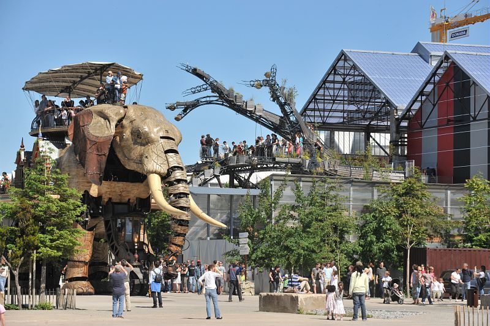
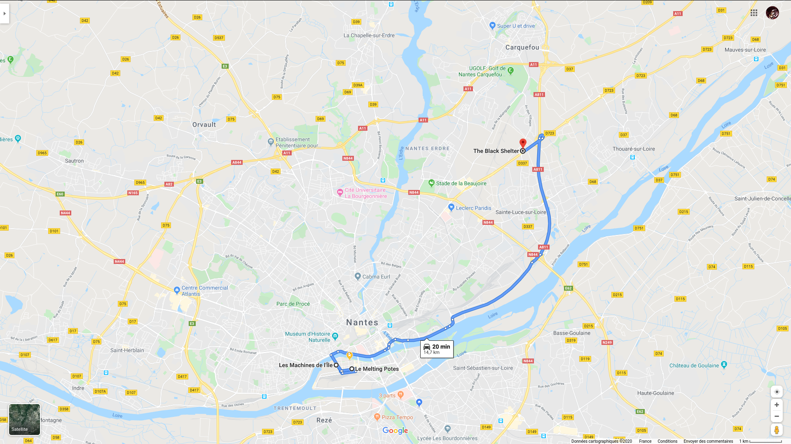

<!-- _class: main-heading-top h1-white -->

# Demo MARP
###### Anthony Pena - https://k49.fr.nf

---
<!-- _class: main-heading h1-white -->

# Paris

---
<!-- _class: main-heading h1-white -->

# Nantes

<!-- Sometimes, we need presenter notes -->

---

## From Melting Potes   to Black Shelter
# Eat Burgers!
<!--
Sometimes, 
we need multilines presenter notes
 -->

---

---

---

# Sometimes, a title is all we need to make a slide

---

